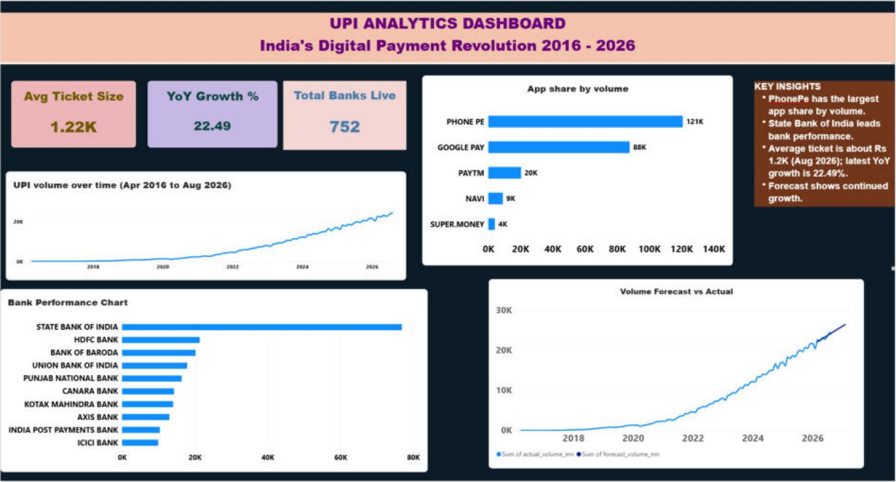

# UPI Reliability & Growth Analytics Scorecard

Resume project for data analyst roles. Built entirely on public NPCI data (plus a Kaggle copy of NPCI's older monthly figures).

## Data (data/raw)
| File | What | Source |
|---|---|---|
| `npci_upi_monthly_FY2025-26.xlsx` | Monthly UPI banks live, volume, value, Apr 2025 to Mar 2026 | NPCI UPI product statistics page, downloaded 2026-09-30 |
| `npci_upi_monthly_FY2026-27.xlsx` | Same columns, Apr to Aug 2026 | NPCI UPI product statistics page, downloaded 2026-09-30 |
| `upi_monthly_2016-04_to_2025-08.csv` | Same columns, Apr 2016 to Aug 2025 | Kaggle: [UPI Transaction Monthly Data (India, 2016-2025)](https://www.kaggle.com/datasets/syedahmadrayyan/upi-transaction-monthly-data-india-20162025), a copy of NPCI figures. Its Apr to Aug 2025 rows match the NPCI FY2025-26 file exactly |
| `bank_top50/*.xlsx` | Top 50 remitter banks per month (Jan 2025, Sep 2025 to Aug 2026): volume, approved %, BD %, TD %, debit reversals | NPCI Ecosystem Statistics > Top 50 Member Performance (Remitter) |
| `chargeback/*.xlsx` | Chargebacks per beneficiary bank per month | NPCI Ecosystem Statistics > Chargeback |
| `upi_apps/*.xlsx`, `*.json` | Volume and value per UPI app per month (Sep 2025 to Aug 2026) | NPCI Ecosystem Statistics > UPI Applications. Mar, May, Jun 2026 saved from the page as .json because NPCI's download link returned 404 |

Where monthly files overlap, the NPCI download is used. Together they cover Apr 2016 to Aug 2026 with no missing months.

## Structure
- data/ → raw/ (NPCI downloads + Kaggle CSV), processed/ (made by the cleaner), reference/bank_type.csv
- python/ → data_cleaning.py, load_to_mysql.py (run this), forecast.py
- sql/ → 00 log tables, 01 schema, 02 analysis queries (18), 03 quality checks, 04 Power BI views
- powerbi/ → `UPI_Analytics_Dashboard.pbix`, a guide for a fuller 7-page version, CSV backups in powerbi/data/ (written by the loader and forecast.py, not committed)
- docs/ → data dictionary, forecast method
- findings/ → forecast chart, interview prep

## Setup (once)
1. Install MySQL 8.0, Python 3.11 or newer, and Power BI Desktop
2. `pip install -r python/requirements.txt`
3. Copy `.env.example` to `.env` and put your MySQL root password in it

## Load data into MySQL (Python)
`python python/load_to_mysql.py`

This cleans `data/raw` into `data/processed`, creates `upi_db` if needed, rebuilds the five data tables
(`upi_monthly`, `bank_monthly`, `app_monthly`, `chargeback_monthly`, `dim_bank`), loads them, logs the run in `etl_run_log`,
creates the Power BI views (`sql/04_views.sql`), and runs 12 data quality checks (`sql/03_quality_checks.sql`, results in `dq_results`).
Safe to re-run any time, for example after adding a new NPCI file to `data/raw`.
Then run `sql/02_analysis_queries.sql` (18 business questions) in MySQL Workbench.

## Forecast (basic ML)
`python python/forecast.py` (after the loader)

It forecasts total UPI volume for the next 6 months with scikit-learn's `LinearRegression`, after testing
it against a naive "same as last month" guess and a constant-% growth model on 5 six-month windows it
never saw. The straight line wins with a 4% average error, against 10% for the naive guess.
Results go to MySQL (`upi_forecast`, `forecast_eval`) and `findings/forecast.png`.
Method, results and limits: [docs/forecast.md](docs/forecast.md).

## Dashboard

`powerbi/UPI_Analytics_Dashboard.pbix` (one page) reads the CSV exports in `powerbi/data/`:

- KPI cards: average ticket size in the latest month (Rs 1,217, Aug 2026), YoY volume growth (22.49%), banks live (752)
- UPI volume over time, Apr 2016 to Aug 2026
- App share by volume, Sep 2025 to Aug 2026 (PhonePe and Google Pay lead)
- Bank volume, Sep 2025 to Aug 2026 (State Bank of India leads)
- Actual volume with the 6-month linear-trend forecast

Its data source paths point to `C:\Users\khalo\Documents\upi-project\powerbi\data`. On another machine, change them in
Transform data > Data source settings, run the loader and `forecast.py`, then Refresh.

A fuller 7-page version, step by step: [powerbi/POWERBI_GUIDE.md](powerbi/POWERBI_GUIDE.md).

Column meanings, KPI formulas and known limitations: [docs/data_dictionary.md](docs/data_dictionary.md).
