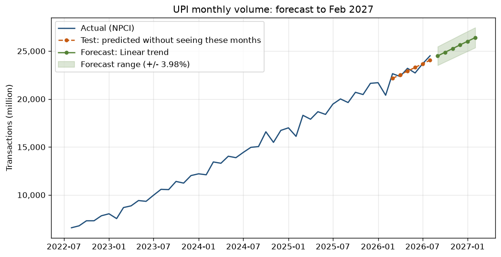

# UPI volume forecast (Phase 6, basic ML)

Script: `python/forecast.py`. Run it after the loader:

```
python python/forecast.py
```



## Question

How many UPI transactions will there be each month for the next 6 months (Sep 2026 to Feb 2027)?

## Method

- **Data:** `upi_monthly.volume_mn`, one row per month, from MySQL.
- **Feature:** month number (1, 2, 3, ...). Target: that month's volume in millions.
- **Training window:** the 36 months before each test. UPI grew far faster in its early years
  (and dipped in 2020), so older months would pull the line the wrong way. On the latest
  6-month test, 24 months gave about the same error as 36, while 48 and 60 months were worse.
- **3 models compared:**
  1. **Naive:** every future month = the last known month (the baseline to beat)
  2. **Linear trend:** `LinearRegression` on month number, so volume grows by the same number of
     transactions each month
  3. **Log-linear trend:** `LinearRegression` on `log(volume)`, so volume grows by the same % each month
- **Testing:** each model predicts 6 months it has never seen. This is repeated on 5 separate
  6-month windows (Mar 2024 to Aug 2026), so one lucky window can't decide the winner.
- **Error measures:** MAE (average miss in million transactions) and MAPE (average miss in %).

## Results (data up to Aug 2026)

| Model | Last 6 months MAPE | Average MAPE, 5 windows | Average MAE (mn) |
|---|---|---|---|
| Naive (repeat last month) | 11.93% | 10.18% | 1,889 |
| **Linear trend** | **1.45%** | **3.98%** | **681** |
| Log-linear trend | 9.14% | 12.06% | 2,179 |

The straight line wins in all 5 windows. It adds about 383 million transactions a month.

| Month | Forecast (mn) | Low | High |
|---|---|---|---|
| Sep 2026 | 24,492 | 23,517 | 25,467 |
| Oct 2026 | 24,875 | 23,885 | 25,865 |
| Nov 2026 | 25,257 | 24,252 | 26,262 |
| Dec 2026 | 25,640 | 24,619 | 26,660 |
| Jan 2027 | 26,023 | 24,987 | 27,058 |
| Feb 2027 | 26,405 | 25,354 | 27,456 |

Low and high are the forecast minus and plus 3.98%, the model's average test error.
The numbers change when a new month is loaded; the script prints the latest ones.

## Why the straight line beats the % growth model

UPI still adds a similar number of transactions every month, but that is a smaller % each year:
year-on-year growth fell from about 58% in 2023 to about 22% in Aug 2026. A constant-% model
assumes the old fast growth continues, so it over-predicts.

## Limitations

- It only uses time, so it ignores the March year-end spike and the Oct-Nov festive bump
  (see Q5 in `sql/02_analysis_queries.sql`). Those months will be above the line.
- It can't know about shocks such as a policy change, an outage or a new UPI charge.
- 6 months ahead only. Past that, the slowdown in growth matters more than a straight line can show.

## Outputs

| Where | What |
|---|---|
| MySQL `upi_forecast` | One row per month: `row_type` actual / test / future, actual and forecast volume, low and high |
| MySQL `forecast_eval` | Every model x test window with MAE and MAPE |
| `powerbi/data/upi_forecast.csv` | Same as `upi_forecast`, for Power BI if MySQL won't connect |
| `findings/forecast.png` | The chart above |

## Bank reliability tiers (K-Means): tried, not used

The plan had an optional K-Means step to group banks into "Reliable / Improving / Risky" using
average technical decline %, its trend and volume. On the 51 banks with at least 6 months of data:

- With volume included, the clusters just split big banks from small banks.
- With only decline % and trend, one bank with a 5% decline rate got a cluster to itself, and no
  "Improving" group appeared.

So the dashboard ranks banks with the plain `TD vs Industry` measure instead, which is easier to
explain and act on.

## How to explain it in an interview

- "I forecast monthly UPI volume with scikit-learn's LinearRegression and tested it on 5 six-month
  windows it hadn't seen. Its average error was 4%, against 10% for a naive 'same as last month' guess."
- "I also tried a log model for constant % growth. It was worse, because UPI's growth rate is slowing,
  so a straight line fits better."
- "It ignores seasonality, so March and festive months come in above the forecast."
